<div align="center">

# 🪞 REFLECTRA
### **Adaptive Multi-Agent Biometric Emotion Mirror**
*Where Computer Vision meets Emotional Intelligence.*

[](https://fastapi.tiangolo.com)
[](https://react.dev)
[](https://github.com/serengil/deepface)
[](https://developer.mozilla.org/en-US/docs/Web/API/Web_Audio_API)
[](https://tailwindcss.com)
[](https://opensource.org/licenses/MIT)

<br />

> *"Look into the mirror. Watch your mind reflect in real-time."*  
> **REFLECTRA** is a real-time affective computing system that captures facial micro-expressions at 5–10 Hz, smooths emotional momentum across temporal rolling windows, projects affective states onto a continuous **2D Russell Circumplex Vector Field**, and synthesizes empathic vocal reflections using a **5-Agent Autonomous Neural Pipeline**.

<br />

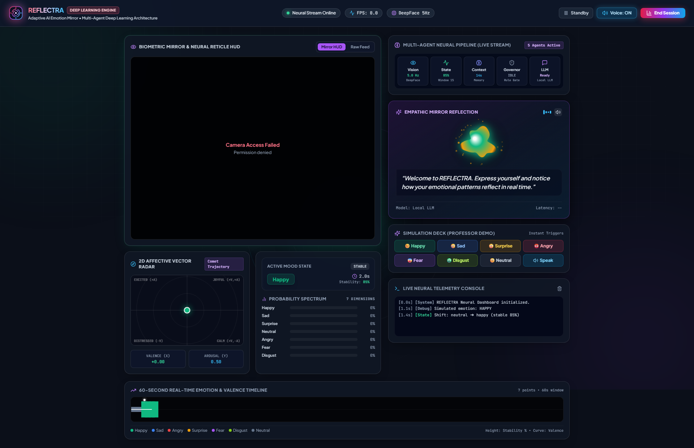

</div>

---

## ⚡ Punchlines & Core Highlights

* 🧠 **Look, Feel, Reflect**: Continuous 60 FPS biometric face tracking paired with 5 Hz deep neural emotion classification.
* 🌌 **Zero-Box Spatial Hologram**: Ultra-futuristic bootloader featuring a floating holographic HUD, matrix digital rain, and an edge-to-edge subtle motherboard circuit grid.
* 🔮 **Prismatic Liquid Hybrid Core**: Outer optical diffraction prism blades dilate and rotate around a harmonic 2D fluid Living Emotion Orb.
* 🌈 **4-Stage Chromatic Evolution**: Watch the interface dynamically shift through **Cryo Cyan** $\rightarrow$ **Neural Violet** $\rightarrow$ **Solar Amber** $\rightarrow$ **Emerald Supernova** as high-voltage capacitors energize.
* 🔊 **Procedural Web Audio Engine**: Zero external audio files — dual detuned transformer sawtooth coils ($70\text{ Hz} \rightarrow 980\text{ Hz}$), resonant filter sweeps, spark crackles, and sub-bass booms synthesized directly via the Web Audio API.
* 🧭 **Continuous 2D Russell Circumplex Radar**: Real-time affective modeling mapping emotions along orthogonal **Valence** (pleasure-displeasure) and **Arousal** (activation-deactivation) axes with a 30-second glowing comet trail.
* 🤖 **5-Agent Coordinated Intelligence**: Vision, State Smoothing, Context Memory, Reaction Governor, and LLM Reflection Agents collaborate with zero latency.
* 🎓 **1-Click Professor Demo Deck**: Live simulation hotkeys (`1`–`7`) and instant state overrides for flawless, deterministic demonstrations.

---

## 📸 Visual Showcase

### 1. The Spatial Holographic Bootloader
The activation sequence charges a procedural transformer circuit with rising coil audio feedback, dynamic spectrum telemetry, and an edge-to-edge background PCB grid:

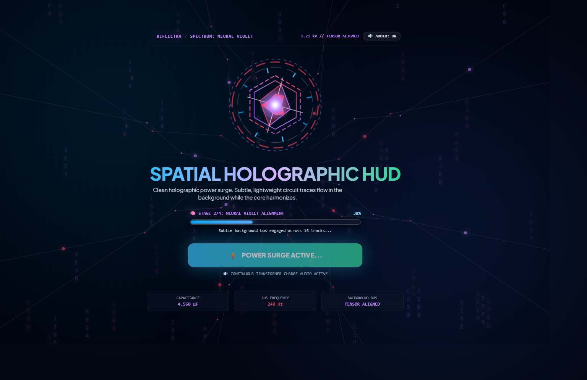

---

### 2. 4-Stage Chromatic Evolution Spectrum
As the power surge progresses from $0\% \rightarrow 100\%$, all SVG gradients, circuit electron pulses, ambient glows, and audio harmonies evolve in real-time:

| Stage 1: Cryo Cyan (0–25%) | Stage 2: Neural Violet (25–50%) |
| :---: | :---: |
| 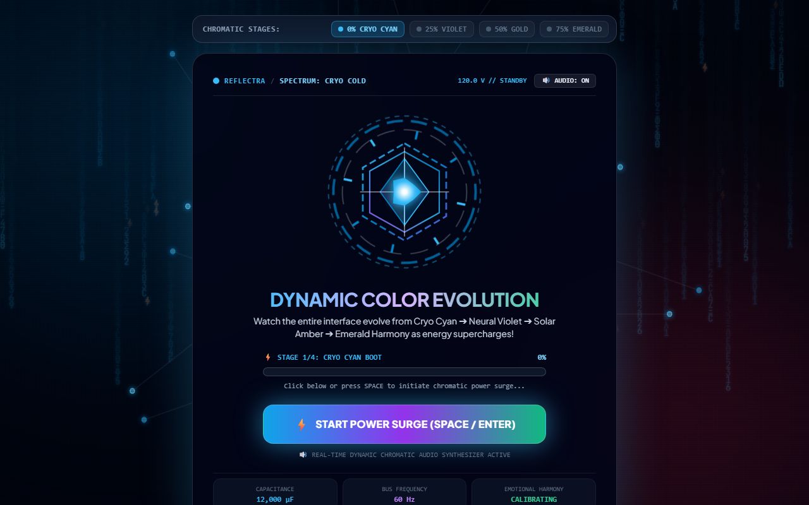 | 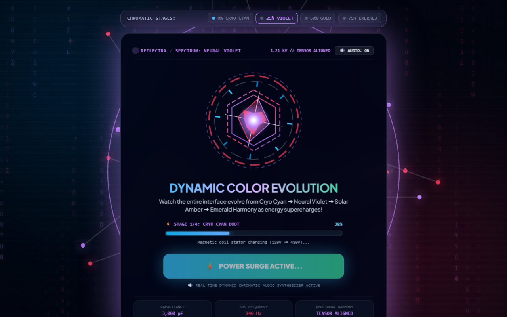 |
| **Magnetic Stator Coil Charging (120 V)** | **Tensor Motherboard Bus Engaged (1.21 kV)** |
| **Stage 3: Solar Amber (50–75%)** | **Stage 4: Emerald Supernova (75–100%)** |
| 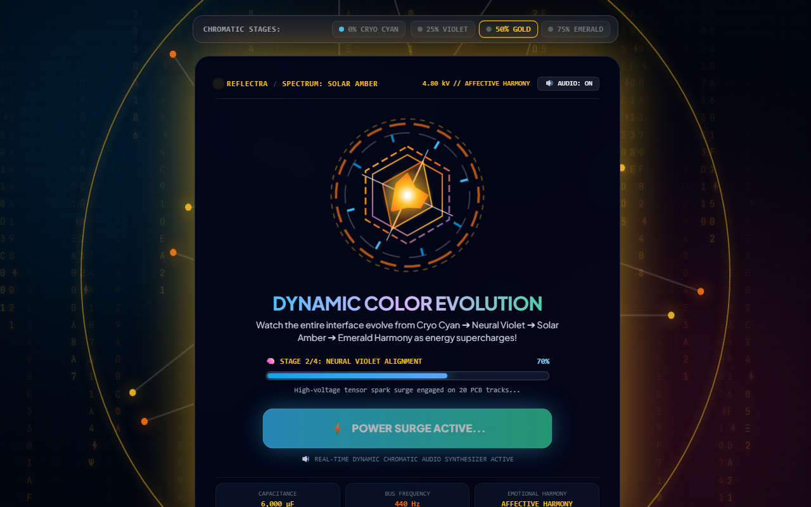 | 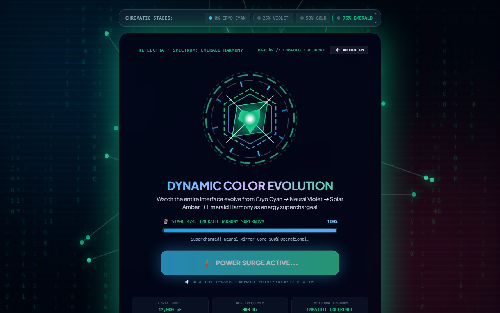 |
| **Circumplex Vector Field Synchronized (4.80 kV)** | **Empathic Coherence Supercharged (10.0 kV)** |

---

### 3. Living Emotion Core Variations
Developed with 4 swappable mathematical visualization archetypes, converging into the **Prismatic Liquid Hybrid Core**:

| Option 1: Prismatic Iris | Option 2: Living Fluid Orb |
| :---: | :---: |
| 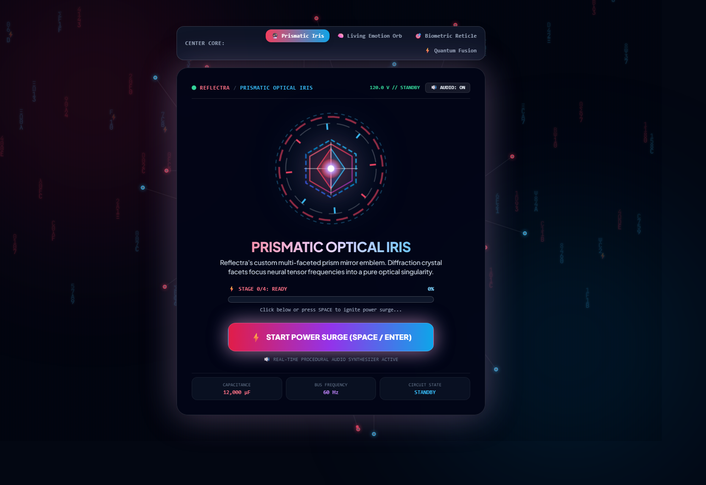 | 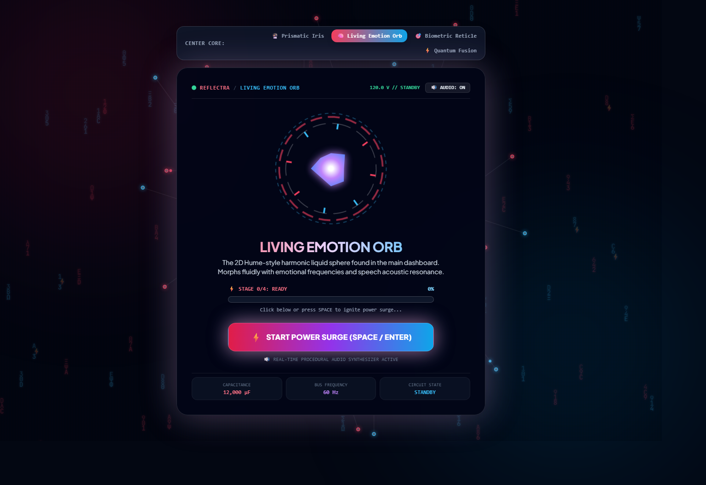 |
| *Hexagonal crystal facets with aperture dilation* | *Audio-reactive harmonic spline fluid mesh* |
| **Option 3: Biometric Reticle** | **Option 4: Quantum Fusion Core** |
| 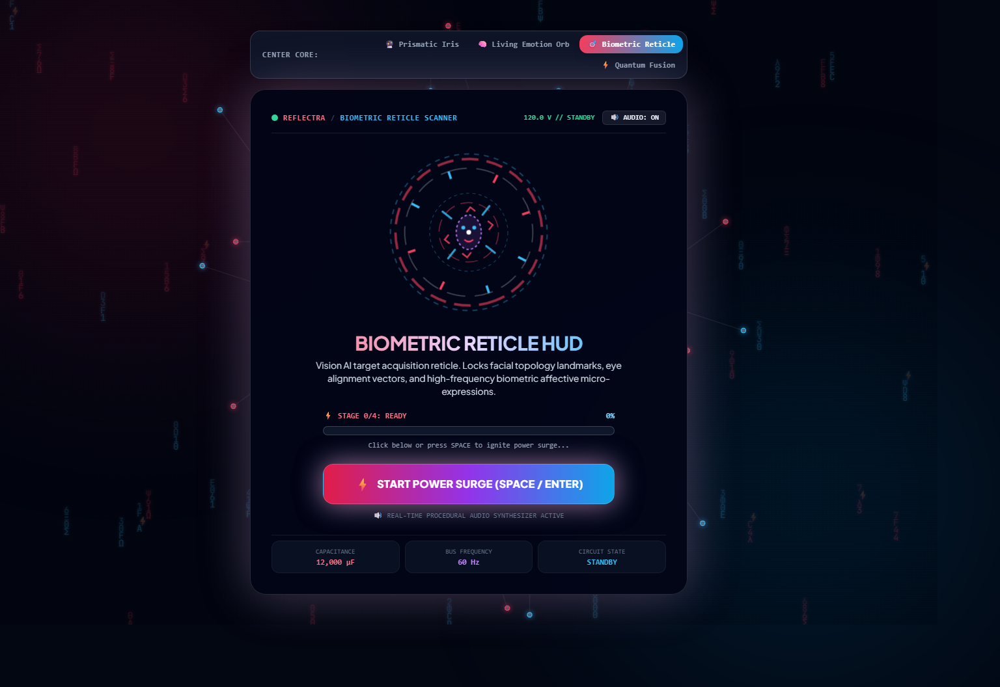 | 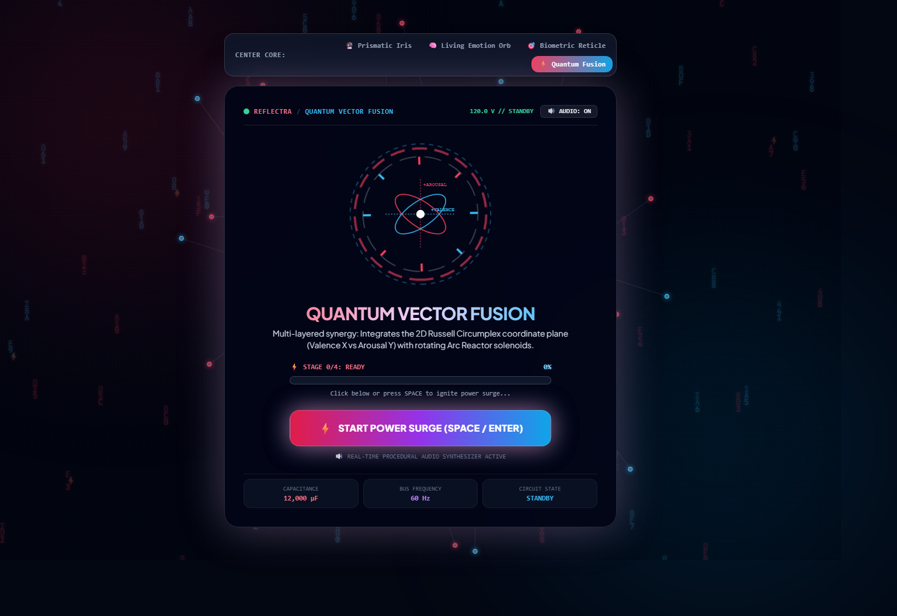 |
| *Targeting crosshairs & telemetry dials* | *Multi-ring magnetic toroidal containment* |

---

## 🏛️ 5-Agent Neural Pipeline Architecture

REFLECTRA replaces traditional rigid monolithic pipelines with a **decoupled, multi-agent asyncio architecture**:

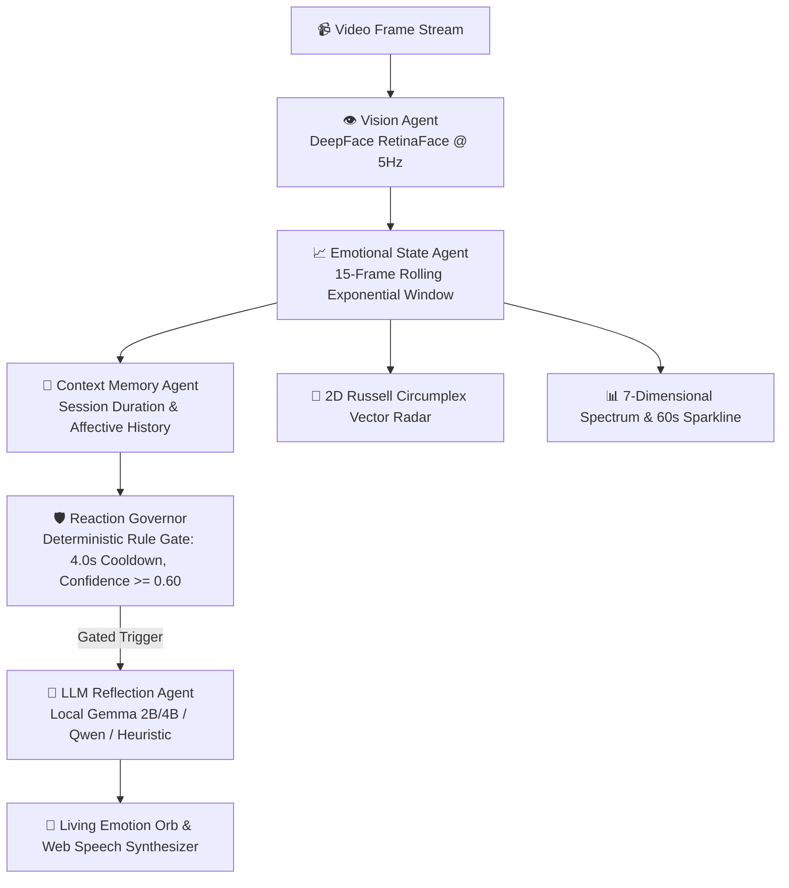

### Agent Roles & Responsibilities:
1. **Vision Agent (`agents/vision.py`)**: Captures video frames, extracts 7-class emotion probabilities (`happy`, `sad`, `surprise`, `angry`, `fear`, `disgust`, `neutral`), face bounding coordinates, and landmark confidence running in non-blocking worker threads.
2. **Emotional State Agent (`agents/state.py`)**: Smooths raw frames using a 15-frame rolling exponential window to filter single-frame blinks or micro-jitters, outputting stability ($0\% \rightarrow 100\%$) and trend directions (`rising`, `falling`, `stable`).
3. **Context Memory Agent (`agents/context.py`)**: Maintains real-time session duration, historical emotional transitions, and dominant affective trends.
4. **Reaction Governor (`agents/governor.py`)**: Deterministic gating engine enforcing sustained emotional shifts ($\ge 1.2\text{s}$), confidence thresholds ($\ge 0.60$), and a 4.0s minimum cooldown to prevent notification fatigue.
5. **LLM Reflection Agent (`agents/llm.py`)**: Crafts natural, empathetic mirror reflections describing observed facial expressions (with regex sanitization to strip chain-of-thought artifacts) and synthesizes vocal responses via Web Speech.

---

## 📐 Mathematical Affective Modeling

### 1. 2D Russell Circumplex Mapping
Emotions are mapped onto a continuous Cartesian plane where $x \in [-1, 1]$ represents **Valence** (Pleasure) and $y \in [-1, 1]$ represents **Arousal** (Activation):

$$\mathbf{v}_{\text{affect}} = \sum_{k \in \mathcal{E}} P(k) \cdot \begin{bmatrix} V_k \\ A_k \end{bmatrix}$$

$$\text{Radius } R = \sqrt{V^2 + A^2}, \quad \theta = \operatorname{atan2}(A, V)$$

| Emotion | Valence ($V$) | Arousal ($A$) | Quadrant |
|---|:---:|:---:|---|
| **Happy / Joy** | $+0.85$ | $+0.65$ | **Q1 (Excited / Joyful)** |
| **Surprise** | $+0.20$ | $+0.80$ | **Q1 (High Activation)** |
| **Angry** | $-0.75$ | $+0.70$ | **Q2 (Distressed / High Arousal)** |
| **Fear** | $-0.65$ | $+0.60$ | **Q2 (Anxious / High Arousal)** |
| **Disgust** | $-0.60$ | $+0.20$ | **Q2 (Aversive)** |
| **Sad** | $-0.80$ | $-0.60$ | **Q3 (Depressed / Low Arousal)** |
| **Neutral / Calm** | $+0.00$ | $-0.20$ | **Q4 (Tranquil / Equilibrium)** |

---

## 🚀 Quickstart Guide

### Prerequisites
- **Python 3.10+** (tested on Python 3.11)
- **Node.js 18+** & **npm**
- Modern Web Browser (Chrome, Edge, Firefox, Brave)
- Webcam (built-in or USB)

---

### Installation

```bash
# 1. Clone the repository
git clone https://github.com/iam-tarun-86/Reflectra.git
cd Reflectra

# 2. Setup Python Virtual Environment
python -m venv .venv

# Windows (PowerShell):
.\.venv\Scripts\Activate.ps1

# macOS / Linux:
source .venv/bin/activate

# 3. Install Backend Dependencies
pip install -r requirements.txt

# 4. Install Frontend Dependencies & Build Bundle
cd frontend
npm install
npm run build
cd ..
```

---

### Launching REFLECTRA

Start the unified master runner with pre-flight health checks:

```bash
python run.py
```

The master launcher will:
1. Run automated pre-flight diagnostics (ports, Python environment, webcam).
2. Start the FastAPI WebSocket & REST backend.
3. Automatically launch your default browser at **`http://localhost:8000`**.

---

## 🎮 Interactive Hotkeys (Professor Demo Deck)

During live demonstrations, use physical keyboard hotkeys to simulate expressions instantly:

| Key | Mood Trigger | Target Valence ($V$) | Target Arousal ($A$) |
|:---:|:---:|:---:|:---:|
| <kbd>SPACE</kbd> / <kbd>ENTER</kbd> | **Power Surge Ignition** | — | — |
| <kbd>1</kbd> | **Happy / Joy** | $+0.85$ | $+0.65$ |
| <kbd>2</kbd> | **Sad / Somber** | $-0.80$ | $-0.60$ |
| <kbd>3</kbd> | **Surprise** | $+0.20$ | $+0.80$ |
| <kbd>4</kbd> | **Angry** | $-0.75$ | $+0.70$ |
| <kbd>5</kbd> | **Fear** | $-0.65$ | $+0.60$ |
| <kbd>6</kbd> | **Disgust** | $-0.60$ | $+0.20$ |
| <kbd>7</kbd> | **Neutral / Calm** | $+0.00$ | $-0.20$ |

---

## 🧪 Testing & Code Quality

REFLECTRA adheres to strict enterprise software standards:

```bash
# Run Backend Pytest Suite (17/17 Unit & Integration Tests)
pytest tests/ -v

# Run Frontend ESLint (0 errors, 0 warnings)
cd frontend
npm run lint

# Run Production Bundle Build Verification
npm run build
```

---

## 📂 Project Structure

```
Reflectra/
├── agents/                      # 5-Agent Autonomous Neural Architecture
│   ├── vision.py                # DeepFace RetinaFace frame processor (5Hz)
│   ├── state.py                 # 15-frame rolling exponential affect buffer
│   ├── context.py               # Session memory & transition tracking
│   ├── governor.py              # Reaction gating & cooldown manager
│   ├── llm.py                   # Contextual empathetic reflection agent
│   └── models.py                # Pydantic data schemas & state models
├── backend/                     # High-Performance FastAPI Engine
│   ├── app.py                   # WebSocket binary demuxer & API routes
│   └── bench_llm.py             # LLM latency benchmarking suite
├── frontend/                    # Modern React 18 SPA (Vite + Tailwind)
│   ├── src/
│   │   ├── components/
│   │   │   ├── WelcomeHero.jsx         # Spatial Hologram & Prismatic Core Bootloader
│   │   │   ├── BiometricMirror.jsx     # 60 FPS video mirror with Neural Reticle HUD
│   │   │   ├── EmotionRadar.jsx        # 2D Russell Circumplex Vector Space
│   │   │   ├── LivingEmotionOrb.jsx    # Fluid harmonic emotion mesh
│   │   │   ├── SpokenReflection.jsx    # Empathic speech & LLM reflection card
│   │   │   ├── NeuralPipeline.jsx      # Live 5-agent telemetry status strip
│   │   │   ├── EmotionSpectrum.jsx     # 7-dimensional probability bar charts
│   │   │   ├── TimelineStream.jsx      # 60s real-time timeline sparkline
│   │   │   ├── DemoDeck.jsx            # Interactive simulation trigger pad
│   │   │   ├── TelemetryConsole.jsx    # High-tech live log terminal
│   │   │   └── AnalyticsModal.jsx      # Full session analytics & JSON exporter
│   │   ├── utils/
│   │   │   └── audioFX.js              # Procedural Web Audio API synthesizer
│   │   └── hooks/
│   │       ├── useFaceTracker.js       # Bounding box smoothing hook
│   │       ├── useSpeech.js            # Web Speech API speech controller
│   │       └── useWebSocket.js         # Binary WebSocket communication hook
├── docs/assets/                 # High-resolution documentation images & diagrams
├── tests/                       # Automated Pytest validation suite
├── run.py                       # Unified master launcher with health checks
└── README.md                    # System documentation
```

---

## 📄 License

This project is licensed under the **MIT License** — see the [LICENSE](LICENSE) file for details.

<div align="center">
  <sub>Engineered with ❤️ for Cognitive Computing & Human-Computer Symbiosis.</sub>
</div>
